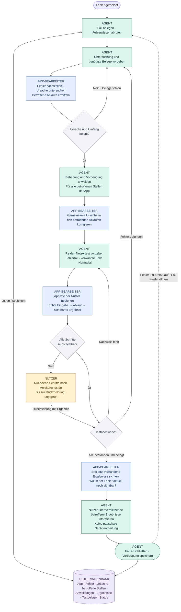

# URS · Fehlerbehebungsagent

**Entwurf · 26.09.2026**

**Ziel:** Die belegte Fehlerursache in der gesamten betroffenen App beheben und gegen Wiederholung absichern.

**Rollen:** Agent = Anweisungen und Fehlerwissen · App-Bearbeiter = untersuchen, umsetzen, testen · Nutzer = offene Testschritte.

**Verbindlich:** Jeder Schritt wird im Fehlerfall gespeichert. Fehlende Belege führen zu einer konkreten nächsten Anweisung. Nach dem Nutzertest werden vorhandene Ergebnisse auf noch sichtbare Fehler geprüft und dem Nutzer benannt. Sie werden nicht pauschal geändert; über eine Nachbearbeitung wird gesondert entschieden. „Behoben“ bezieht sich auf die nachweislich korrigierte App-Ursache; offene Nutzertests bleiben offen. Eingaben und vorhandene Nutzerarbeit bleiben erhalten.

**Umsetzung:** `agent.toml` enthält die Anweisungen. `fehlerbehebung.py` startet den Agenten über die lokale Codex-CLI und speichert Meldungen sowie Antworten automatisch in `faelle/`. Ein Fall wird erst nach belegtem Nutzertest, späterer Sichtung bestehender Ergebnisse und dokumentierter Nutzerinformation abgeschlossen.
