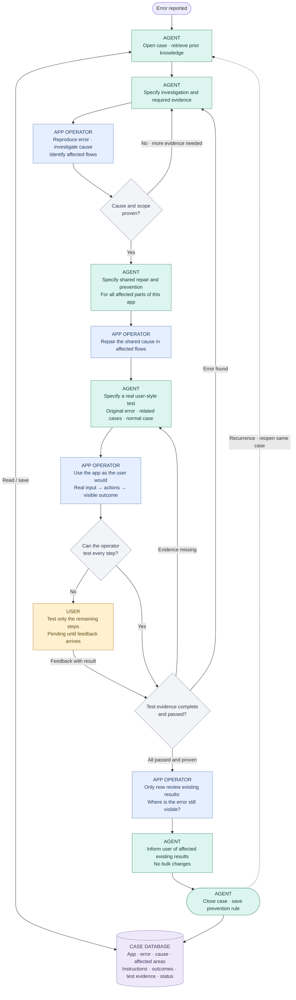

# URS · Repair Agent

**Draft · 26 September 2026**

**Goal:** Repair the proven cause across the affected app and reduce the chance of recurrence.

**Roles:** Agent = instructions and case knowledge · App operator = investigate, implement, test · User = steps the operator cannot test.

**Required:** Save each step in the case record. Missing evidence must lead to a concrete next instruction. After the user-style test, review existing results and tell the user where the error is still visible. Do not change those results in bulk; decide on remediation separately. “Fixed” refers to the proven repair of the app mechanism. Untested user steps remain open. Preserve all inputs and existing user work.

**Implementation:** `agent.toml` contains the instructions. `fehlerbehebung.py` runs the agent through the local Codex CLI and automatically stores reports and responses in `faelle/`. A case closes only after evidenced testing, a later review of existing results, and documented user notification.
